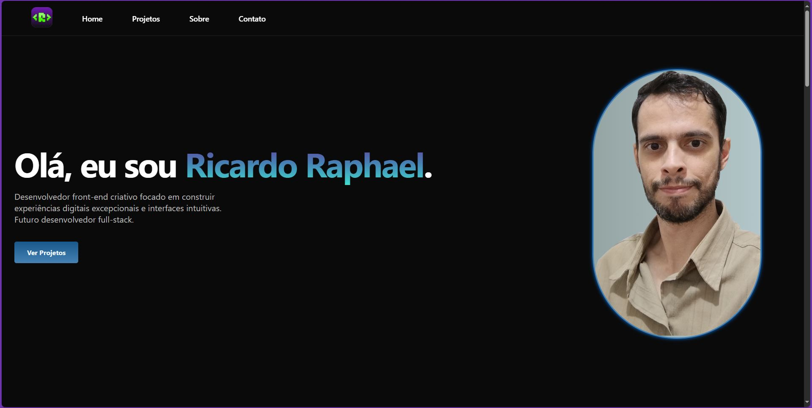
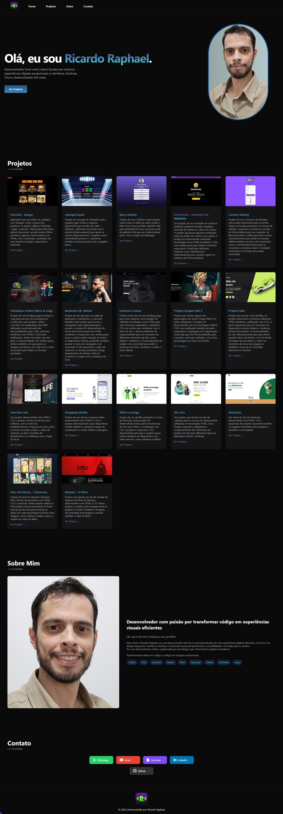
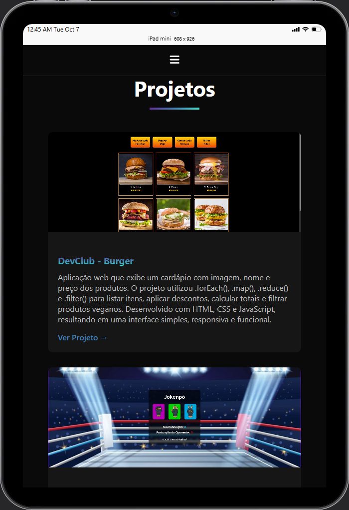

  

 
 

  

<h1 align="center"> 
	✨​​ Meu Portfolio ✨​​
</h1>

  

## 💻 Sobre o projeto

  Desenvolvimento do meu portfólio pessoal para mostrar meus projetos e conhecimentos nas tecnologias que tenho domínio 
  e habilidades, neste portfolio mostro a galeria de projetos que desenvolvi e o link para acessá-los em diferentes dispositivos. 
  O o projeto apresenta um menu de navegação muito intuitivo para o usuário poder navegar entre as seções. Sinta-se a vontade para 
  conferir meu portfólio.

---

## 🎨 Imagens do Projeto

### Web

  

### Mobile

  	
  	

---

## 🛠 Tecnologias

<h3>As seguintes tecnologias foram utilizadas no projeto:</h3>

  
  
  
  
  
  

---

## 👨‍💻​ Autor

<b>Ricardo Raphael</b>✨

---

Feito com ❤️ por Ricardo Raphael 👋🏽 [Entre em contato!](https://www.linkedin.com/in/ricardoapraphael/)

